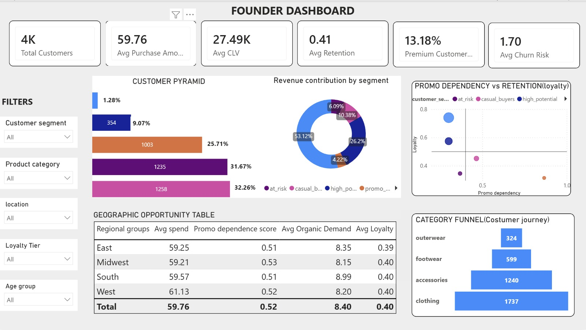

# Customer Segmentation & Retention Analytics

## Overview

This project analyzes customer purchase behavior for a Direct-to-Consumer (D2C) retail business to identify retention drivers, customer value patterns, and promotional dependency. The objective is to improve customer retention through data-driven segmentation, behavioral analysis, and strategic recommendations.

The project combines **Python**, **MySQL**, and **Power BI** to build a complete analytics workflow covering data preparation, feature engineering, customer segmentation, business analysis, and dashboard development.

---

## Problem Statement

The business relies heavily on promotional discounts to drive sales but lacks visibility into:

* Which customers are likely to remain loyal over time
* Which customers are highly dependent on promotions
* What factors drive customer value and retention
* Which regions and customer groups offer growth opportunities
* How promotional strategies can be optimized

The goal is to develop a data-driven retention strategy that improves customer loyalty while reducing unnecessary discount dependency.

---

## Dataset

The dataset contains approximately **3,900 customer records** with information related to:

* Demographics
* Purchase behavior
* Product categories
* Subscription status
* Promotional activity
* Customer reviews
* Geographic location

---

## Tech Stack

### Python

* Pandas
* NumPy
* Scikit-learn

### MySQL

* Customer Segmentation
* Retention Analysis
* Business Analytics

### Power BI

* Interactive Dashboarding
* KPI Tracking
* Customer Insights Visualization

---

## Project Workflow

### 1. Data Cleaning

* Handled missing values
* Standardized categorical variables
* Removed inconsistencies
* Prepared data for analysis

### 2. Feature Engineering

Created behavioral metrics such as:

* Loyalty Score
* Promo Dependency Score
* Customer Value Score
* Churn Risk Score
* Purchase Intensity
* Customer Health Score
* Retention Potential Score

### 3. Customer Segmentation

Segmented customers into five behavioral groups:

| Segment        | Description                        |
| -------------- | ---------------------------------- |
| VIP Loyalists  | High loyalty, low promo dependency |
| High Potential | Emerging loyal customers           |
| Casual Buyers  | Moderate engagement and spending   |
| Promo Hunters  | Discount-driven customers          |
| At Risk        | Low retention potential            |

### 4. SQL Analysis

Performed customer analytics to answer key business questions:

* Who are the most valuable customers?
* What drives customer retention?
* Which regions are commercially underleveraged?
* How should promotional strategies change?
* What does the ideal customer profile look like?

### 5. Power BI Dashboard

Developed an interactive dashboard tracking:

* Customer Segmentation
* Loyalty Trends
* Churn Risk
* Promo Dependency
* Geographic Performance
* Retention KPIs

---

## Key Insights

* Subscription customers demonstrated higher loyalty and repeat purchase behavior.
* VIP customers showed low promotional dependency despite strong spending patterns.
* Certain regions exhibited higher average spending, indicating growth opportunities.
* Customer satisfaction positively influenced retention potential.
* Excessive promotional dependency was associated with lower customer loyalty.

---

## Strategic Recommendations

### Short-Term

* Reduce blanket discounting
* Personalize loyalty engagement
* Focus on high-performing regions

### Medium-Term

* Introduce tier-based loyalty programs
* Increase subscription adoption
* Implement segment-specific marketing campaigns

### Long-Term

* Build retention-focused CRM systems
* Deploy predictive churn monitoring
* Shift towards behavior-based promotional strategies

---

## Dashboard Preview



---

## Repository Structure

```text
Customer-Retention-Analytics
│
├── data/
│
├── notebooks/
│   └── customer_retention_analysis.ipynb
│
├── sql/
│   └── customer_retention_queries.sql
│
├── images/
│   └── dashboard.jpeg
│
└── README.md
```
## Author

* Priyanshi Maheshwari
  

